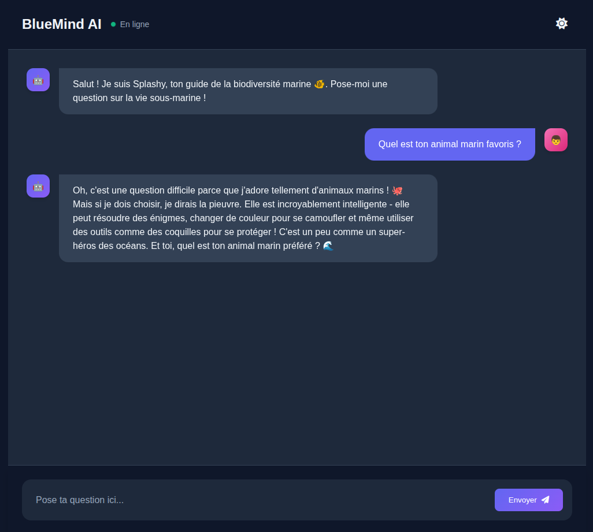

# Mini Projet ChatBot IA

## Description

Ce mini projet est une simple application web développée en Python avec Flask. Ce mini projet a pour but d'expérimenter l'utilisation d'API de différentes intelligences artificielles dans un contexte précis. Ici, le chatbot se nomme Splashy et est conçu pour répondre à des questions sur la biodiversité marine.

<p align="center">
  
</p>

## Installation

1. Cloner le projet
  ```bash
   git clone https://github.com/Math-Baba/BlueMind_AI.git
   cd BlueMind_AI
  ```

2. Créer un environnement virtuel Python
 ```bash
 python3 -m venv venv
 source venv/bin/activate    # Linux/macOS
 venv\Scripts\activate.bat   # Windows
 ```

3. Installer les dépendances
```bash
pip install -r requirements.txt
```

4. Configurer les variables d'environnement
```bash
OPENROUTER_API_KEY="clé API OpenRouter"
```

5. Démarrer le serveur Flask
```bash
python app.py
```
Rendez-vous ensuite sur un navigateur pour taper le lien: http://127.0.0.1:5000/

Ressources :
- [CodePen](https://codepen.io/)
- [OpenRouter](https://openrouter.ai/)

## Auteur
- **Math-Baba** - [GitHub](https://github.com/Math-Baba)
